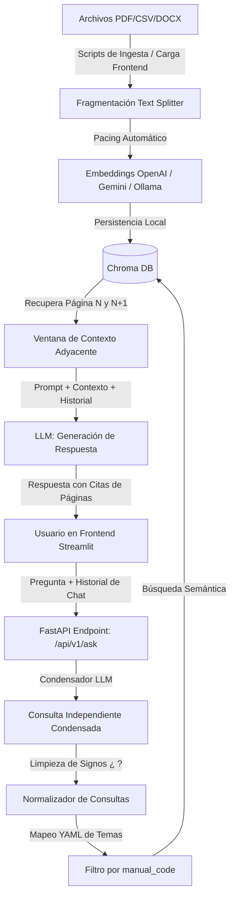

# Exactus RAG Agent - Challenge Alura Agente

Agente de Inteligencia Artificial especializado en la consulta y recuperación de información de los manuales de usuario del ERP Exactus. Desarrollado en Python con una arquitectura RAG (Retrieval-Augmented Generation) parametrizada, FastAPI para el backend, y un frontend interactivo en Streamlit.

---

## 1. Descripción General del Proyecto

Este proyecto resuelve la consulta de información sobre manuales complejos del ERP Exactus (como Facturación, Cuentas por Cobrar, etc.) utilizando IA. El agente RAG extrae, indexa y recupera fragmentos específicos de los manuales en formato PDF, CSV o DOCX para generar respuestas precisas, contextualizadas y citando el documento y página correspondiente de origen.

### Características Clave

- **Memoria Conversacional de Sesión (Conversational Retrieval)**: Admite preguntas de seguimiento de forma inteligente mediante condensación de consultas a través del LLM.
- **Normalización de Consultas**: Elimina signos de interrogación/exclamación y puntuaciones (`¿`, `?`, etc.) antes de buscar en la base de datos vectorial para estabilizar el cálculo de distancias de los embeddings.
- **Expansión de Contexto Adyacente**: Recupera todas las partes de la página de destino y su página contigua ($N+1$) en su totalidad para garantizar que instrucciones de pasos continuos no queden incompletas.
- **Enrutamiento Temático Inteligente**: Prioriza de manera automática el manual correspondiente (ej: Facturación vs. Cuentas por Cobrar) según las palabras clave configuradas en `app/core/manual_routing.yml`.
- **Ingesta Incremental y Pacing**: Permite la carga de nuevos archivos sin reconstruir el índice completo, con tasa de peticiones regulada para evitar cuotas agotadas (429) en proveedores como Gemini.
- **Multi-Proveedor Dinámico**: Cambia dinámicamente entre OpenAI (GPT-4o-mini), Gemini (Gemini 2.5 Flash) y modelos locales de Ollama (Qwen2.5-Coder) desde la interfaz de usuario.

---

## 2. Arquitectura de la Solución Implementada

La solución se divide en tres capas principales: Ingesta, Almacenamiento/Recuperación Semántica y Generación.



### Flujo de Consulta

1. **Condensación**: El backend FastAPI recibe la pregunta del usuario y el historial del chat actual. Si hay historial, reformula la pregunta mediante LLM.
2. **Normalización**: El query se limpia de caracteres de puntuación para evitar sesgos en el embedding.
3. **Filtro Temático**: Se evalúa la consulta frente a las reglas definidas en `app/core/manual_routing.yml` para restringir la búsqueda al manual más relevante (ej: `FA` para Facturación).
4. **Recuperación y Expansión**: Se consulta Chroma DB. Para el chunk obtenido, se expande la recuperación a todos los chunks de esa página y de la página siguiente ($N+1$).
5. **Generación**: El LLM (OpenAI, Gemini u Ollama) recibe el contexto extendido y genera la respuesta final estructurada en español.

---

## 3. Tecnologías y Herramientas Utilizadas

- **Python 3.11**: Lenguaje de programación principal.
- **FastAPI**: Backend para la API de alta velocidad, validando payloads mediante Pydantic.
- **Streamlit**: Interfaz web reactiva para el chat interactivo, la visualización de fuentes y la carga incremental de manuales.
- **LangChain / LangChain Community**: Orquestador principal de la cadena RAG, prompts y conectores de LLM.
- **Chroma DB**: Base de datos vectorial embebida y persistida en disco.
- **OpenAI (GPT-4o-mini / text-embedding-3-small)**: Proveedor principal y más veloz para producción.
- **Gemini (Gemini 2.5 Flash / gemini-embedding-001)**: Proveedor alternativo en la nube.
- **Ollama (Qwen2.5-Coder / nomic-embed-text)**: Soporte para ejecución en local 100% offline.
- **Systemd**: Gestor de procesos en segundo plano para la persistencia del frontend y backend en servidores Linux (Ubuntu en OCI).
- **Caddy Server + DuckDNS**: Servidor de proxy inverso y subdominio dinámico para habilitar SSL (HTTPS) automático mediante Let's Encrypt en producción.

---

## 4. Instrucciones para Ejecutar el Proyecto

### Requisitos Previos

- Python 3.11 instalado.
- Cuenta de OpenAI, Gemini u Ollama configurada localmente.

### A. Configuración del Entorno y Dependencias

1. Clona el repositorio e ingresa a la carpeta del proyecto:
   ```bash
   git clone https://github.com/mcabanillassalas/challenge-alura-agente.git
   cd challenge-alura-agente/agente-alura-rag
   ```
2. Crea e inicia tu entorno virtual e instala las dependencias:
   - **En Windows (PowerShell):**
     ```powershell
     python -m venv env3.11
     .\env3.11\Scripts\Activate.ps1
     pip install -r requirements.txt
     ```
   - **En Linux (Ubuntu):**
     ```bash
     python3 -m venv venv
     source venv/bin/activate
     pip install -r requirements.txt
     ```

3. Crea un archivo `.env` en la raíz del proyecto y configura tus credenciales:

   ```env
   # Proveedor por defecto (openai, gemini, ollama)
   LLM_PROVIDER=openai
   EMBEDDING_PROVIDER=openai

   # OpenAI API Key
   OPENAI_API_KEY=tu_openai_key

   # Gemini API Key
   GEMINI_API_KEY=tu_gemini_key

   # Configuración de Chroma
   CHROMA_PERSIST_DIRECTORY=./data/processed
   DOCS_PATH=./data/raw/exactus
   TOP_K=4
   CHUNK_SIZE=1200
   CHUNK_OVERLAP=150
   ```

### B. Ingesta Inicial de Documentos

Coloca tus archivos PDF en la ruta `data/raw/exactus/` y procesa los documentos:

- **Ingesta incremental automática (pacing incorporado):**
  ```bash
  python -m scripts.ingest_incremental
  ```
- **Reconstrucción desde cero del índice:**
  ```bash
  python -m scripts.rebuild_index
  ```

### C. Ejecución del Servidor Backend (FastAPI)

Levanta la API FastAPI (por defecto corre en el puerto 8000):

```bash
uvicorn app.main:app --reload --host 0.0.0.0 --port 8000
```

Verifica su funcionamiento abriendo en tu navegador: `http://localhost:8000/health`.

### D. Ejecución del Servidor Frontend (Streamlit)

En una nueva terminal con el entorno virtual activo, arranca Streamlit (puerto 8501):

```bash
streamlit run frontend/streamlit_app.py
```

Abre en tu navegador `http://localhost:8501` para interactuar con la interfaz del agente.

---

## 5. Preguntas que el Agente Puede Responder

El agente está diseñado para responder a dudas operativas, configuración, ingreso de catálogos y procesos basados en los manuales indexados:

1. `¿Cómo registrar un cliente nuevo?` (Facturación)
2. `¿Cuáles son sus carpetas?` (Pregunta de seguimiento y memoria conversacional)
3. `¿Cómo definir las direcciones de embarque de un cliente?`
4. `¿Cómo definir los vendedores de un cliente?`
5. `¿Cómo enviar un correo a un cliente?`

---

## 6. Ejemplos de Respuestas Generadas por el Agente

### Ejemplo 1: Consulta Inicial

- **Pregunta:** `¿Cómo registrar un cliente nuevo?`
- **Respuesta generada:**
  > Para registrar un cliente nuevo en el ERP Exactus, debes realizar los siguientes pasos:
  >
  > 1. Accede a la opción **Clientes!** en el menú principal de Facturación. Esto desplegará el listado completo de clientes.
  > 2. Introduce un código alfanumérico de hasta 8 posiciones en el campo de **código de cliente**.
  > 3. Especifica el nombre o descripción del cliente (campo alfanumérico de hasta 30 caracteres).
  > 4. Llena la información correspondiente a las diferentes carpetas que el sistema despliega (_General, Condiciones, Otros, Direcciones, Tarjeta, Rubros Valores, Corporativo y Notas_).
  > 5. Graba los datos ingresados.
  >
  > _Referencia: FA_Manual_Usuario_Facturacion.pdf — página: 116_

### Ejemplo 2: Pregunta de Seguimiento (Usando Memoria Conversacional)

- **Pregunta:** `¿Cuáles son sus carpetas?`
- **Respuesta generada:**
  > Las carpetas disponibles al registrar un cliente en el ERP Exactus son las siguientes:
  >
  > 1. **General**: Información y aspectos generales de identificación.
  > 2. **Condiciones**: Configuración de términos de pago y facturación.
  > 3. **Otros**: Información adicional parametrizada.
  > 4. **Direcciones**: Mantenimiento de direcciones del cliente.
  > 5. **Tarjeta**: Datos de tarjetas asociadas si aplica.
  > 6. **Rubros Valores**: Rubros parametrizados configurables.
  > 7. **Corporativo**: Ajustes de cuentas de corporación.
  > 8. **Notas**: Espacio para observaciones del cliente.
  >
  > _Referencia: FA_Manual_Usuario_Facturacion.pdf — página: 116_
