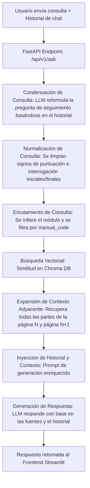

# Arquitectura Base Parametrizada y Flujo Conversacional

## Flujo General RAG con Memoria Conversacional

El flujo del agente RAG sigue un proceso robusto de recuperación y generación secuencial parametrizado:

1. **Ingesta documental**: Los manuales PDF, CSV o DOCX se almacenan en `data/raw/exactus/`. El script de ingesta fragmenta el texto y genera embeddings utilizando el proveedor indicado por `EMBEDDING_PROVIDER` en el `.env`.
2. **Almacenamiento**: Los embeddings se persisten localmente en Chroma DB dentro de `data/processed/`.
3. **Condensación y Normalización**: Cuando entra una consulta, si hay historial conversacional, el LLM la reformula en una consulta independiente. Se eliminan caracteres especiales de interrogación/exclamación para no sesgar las distancias vectoriales.
4. **Recuperación con Expansión**: Se obtienen los mejores fragmentos. Para evitar truncamientos, el retriever extrae la página original en su totalidad y la página consecutiva ($N+1$) (recuperando todos sus chunks mediante `k=4` y filtros de metadatos de Chroma).
5. **Generación**: El LLM responde basándose en el contexto extendido y el historial reciente de la sesión, citando el nombre del documento y número de página.

---

## Componentes del Sistema

- **FastAPI**: Capa de API backend exponiendo `/health`, `/ask` e `/ingest`.
- **Streamlit**: Interfaz web (frontend) que mantiene el estado conversacional en sesión (`st.session_state.messages`) y se comunica con la API.
- **LangChain**: Orquestación de la cadena RAG, enrutamiento, templates de prompt e interactuación con proveedores de LLM.
- **Chroma DB**: Vectorstore local e indexación semántica persistida.
- **Proveedores de IA**: OpenAI (producción prepagada), Gemini y Ollama parametrizados por `.env`.
